# 🖥️ Real-Time Code Sharing System

A modern, real-time code sharing platform designed for educational environments. Students can instantly share their code with lecturers through a VSCode extension, while lecturers monitor submissions through a beautiful web interface with AI-powered code review.

## 🎯 Quick Start (First Time)

**Setup Steps (run once):**
1. Install dependencies: `npm install` in `backend-server`, `lecturer-interface`, and `vscode-extension`
2. Build extension: `cd vscode-extension && npm run build`
3. Start servers: `.\start-servers.ps1`
4. Create students: `.\create-students-simple.ps1`
5. Install extension in each VSCode instance

**Daily Use:**
1. Start servers: `.\start-servers.ps1`
2. Access: `http://localhost:3000`

## 🚀 How to Run the Project

### **Step 1: Start the Backend and Frontend Servers**

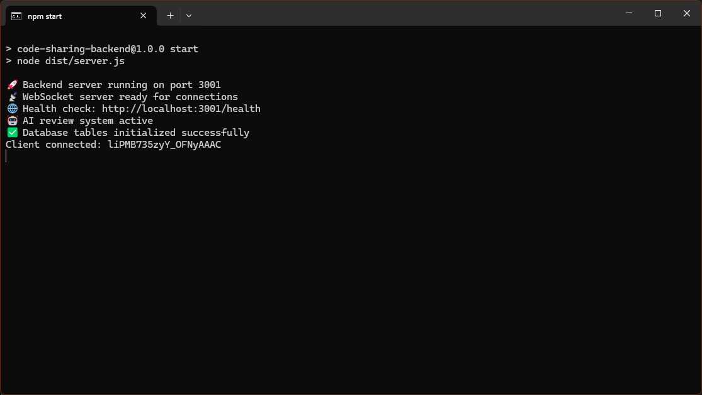
*Starting both servers*

```bash
.\start-servers.ps1
```

Or start them individually:
```bash
# Start backend (Terminal 1)
cd backend-server
npm start

# Start frontend (Terminal 2)
cd lecturer-interface
npm start
```

**Access Points:**
- **Lecturer Interface**: `http://localhost:3000`
- **Backend API**: `http://localhost:3001`

### **Step 2: Create Student VSCode Instances**

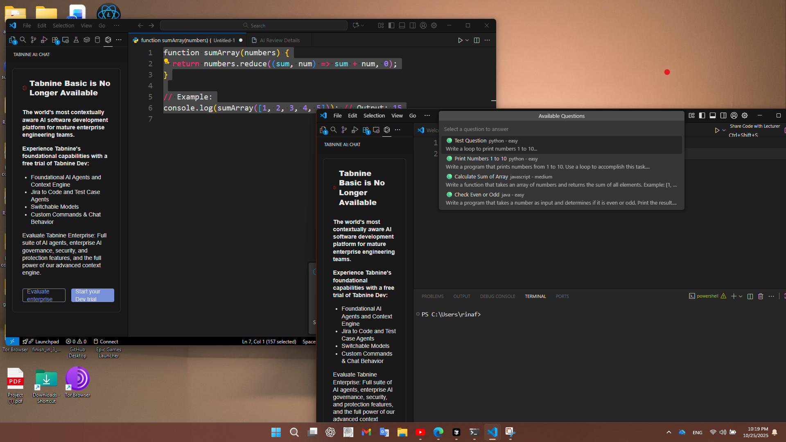
*Multiple VSCode windows for students*

```bash
.\create-students-simple.ps1
```

This will open 4 VSCode instances for students:
- Alice Johnson
- Bob Smith
- Charlie Brown
- Diana Prince

### **Step 3: Build and Install VSCode Extension**

The extension needs to be built first, then installed.

**Building the Extension:**
```bash
cd vscode-extension
npm install

# Install vsce if not already installed
npm install -g @vscode/vsce

# Build the extension
npm run compile
vsce package
```

This creates the `code-sharing-extension-1.0.0.vsix` file in the `vscode-extension` folder.

**Installing the Extension:**

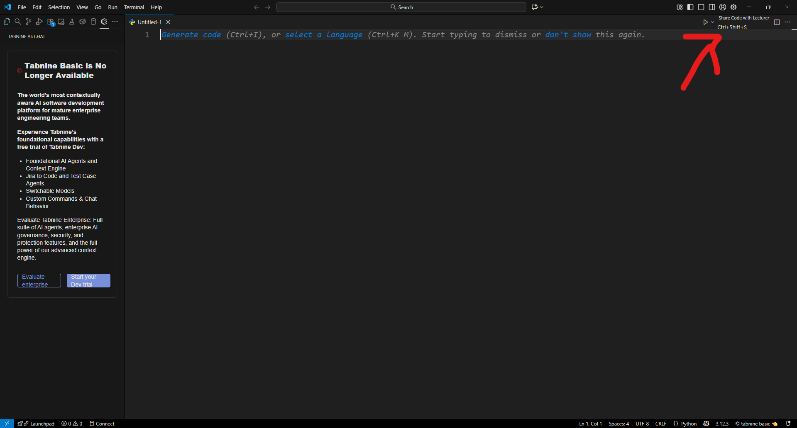
*Installing the code sharing extension*

1. Open each student VSCode instance
2. Press `Ctrl+Shift+P`
3. Type "Extensions: Install from VSIX"
4. Select `vscode-extension\code-sharing-extension-1.0.0.vsix`

**Note:** The VSIX file must be built before installing it. Run the build commands above if you haven't already.

### **Step 4: Access Lecturer Interface**

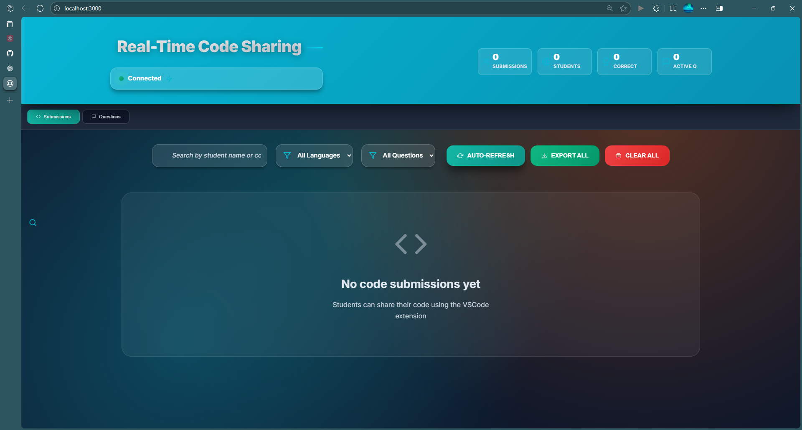
*Lecturer interface ready for submissions*

Open your browser and go to: `http://localhost:3000`

---

## 📸 Features with Screenshots

### **1. Question Management**

#### **Create Questions**

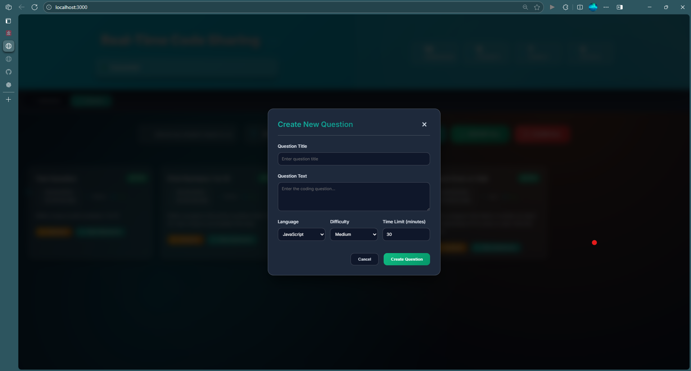
*Question creation form*

**How to use:**
1. Click the "Questions" tab in the lecturer interface
2. Click "Create Question"
3. Fill in:
   - Title: e.g., "Sum of Array Elements"
   - Text: Description of the problem
   - Language: JavaScript, Python, Java, etc.
   - Difficulty: Easy, Medium, or Hard
4. Click "Create Question"

#### **View All Questions**

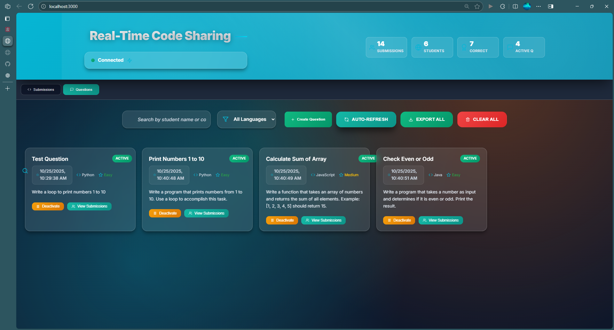
*Questions management interface*

**Features:**
- See all created questions
- Activate/deactivate questions
- Edit existing questions
- Delete questions

#### **Activate Questions**

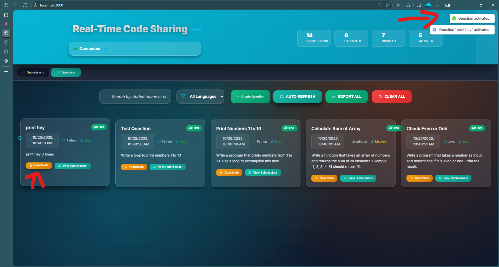
*Question activation*

**How to use:**
1. Click "Questions" tab
2. Find the question you want to activate
3. Click "Activate" button
4. The question becomes available for students to answer

### **2. Student Code Sharing**

#### **Writing Code in VSCode**

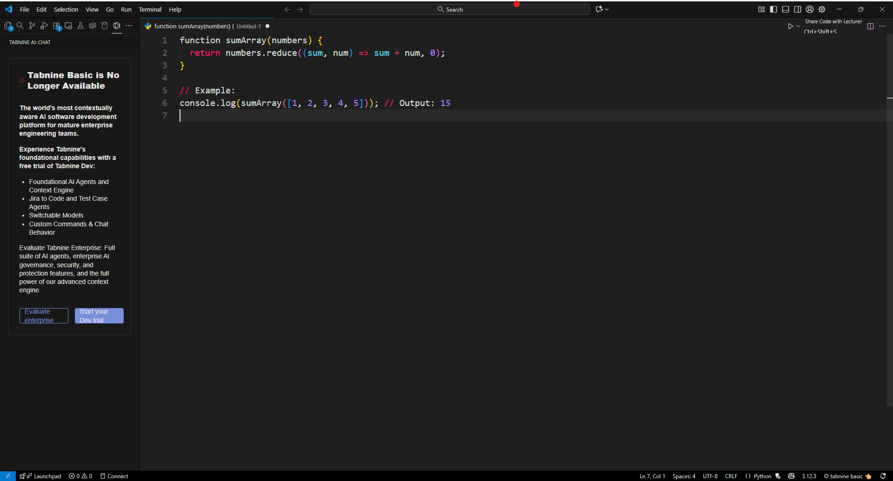
*Student writing code in VSCode*

Students write their code in VSCode. For example:
```javascript
function sumArray(numbers) {
    return numbers.reduce((sum, num) => sum + num, 0);
}
```

#### **Select Code to Share**

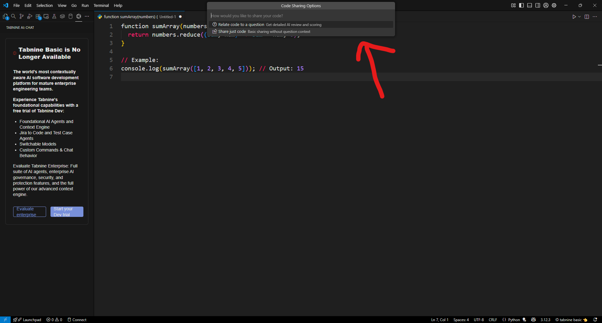
*Student selecting code to share*

Select the code you want to share (optional - can share entire file).

#### **Share Code**

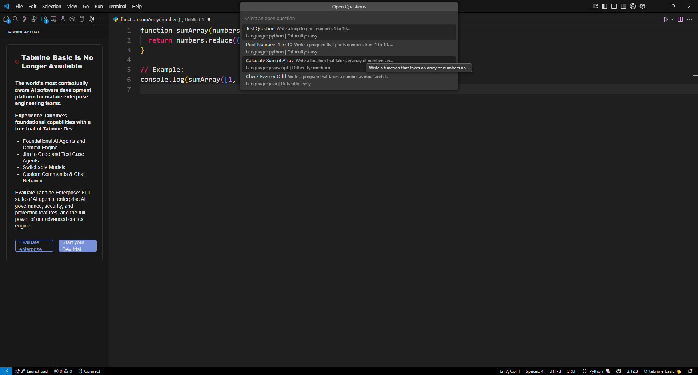
*Student clicking share button*

Click the "Share Code" button in the VSCode extension panel.

### **3. Lecturer Views**

#### **First Submission Appears**

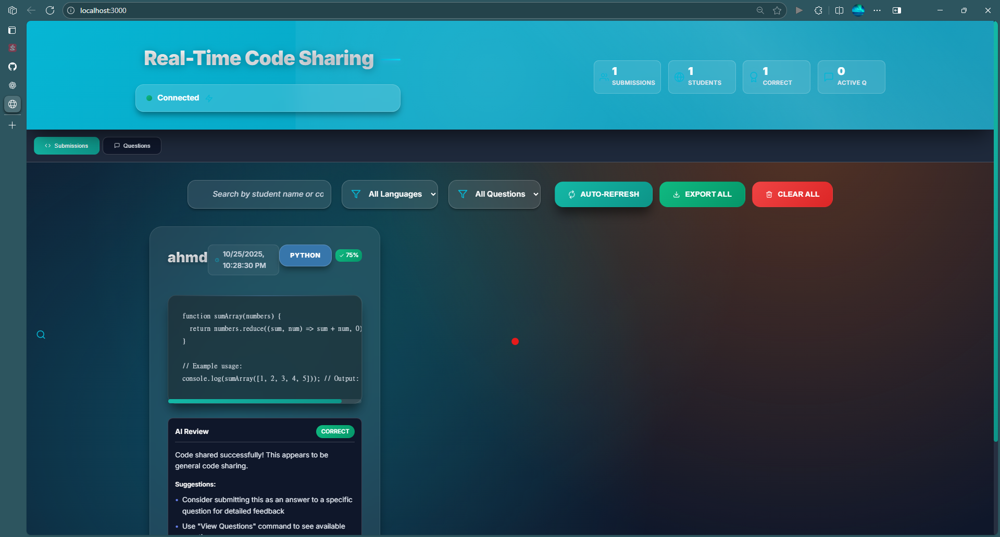
*Lecturer interface showing first submission*

When a student shares code:
- The submission appears instantly in the lecturer interface
- You can see student name, code, language, and timestamp
- Statistics update automatically

#### **Multiple Submissions**

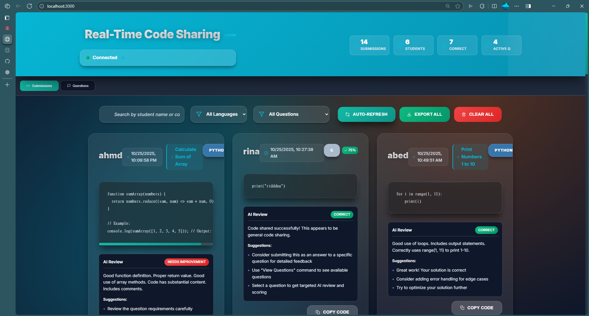
*Multiple submission cards from different students*

**Features:**
- See all submissions from all students
- Each submission is displayed as a card
- Submissions are organized by time (newest first)
- Click on any submission to view details

### **4. AI Code Review**

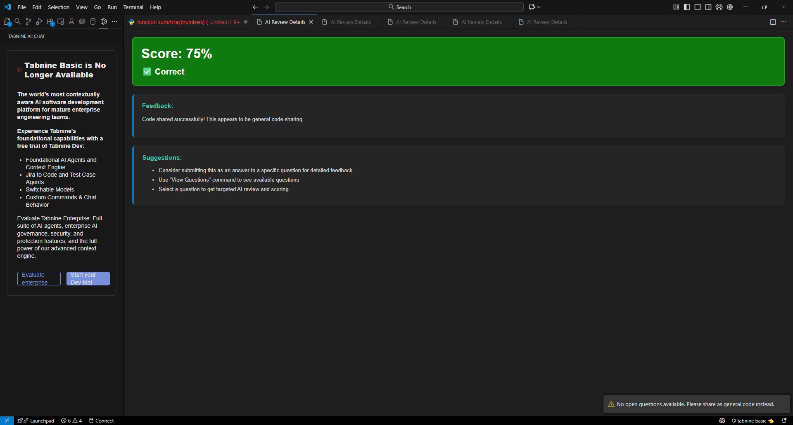
*AI-powered code review with scores and feedback*

**How it works:**
1. When a student submits code, the AI automatically reviews it
2. The AI provides:
   - **Score**: 0-100% based on correctness
   - **Feedback**: Detailed comments on the code
   - **Suggestions**: Improvement recommendations
3. The review appears in the submission card

**AI Review System:**
- Generous scoring (80-100% for correct code)
- Supports multiple languages (JavaScript, Python, Java, C++, etc.)
- Provides constructive feedback
- Gives specific suggestions for improvement

### **5. Student Management**

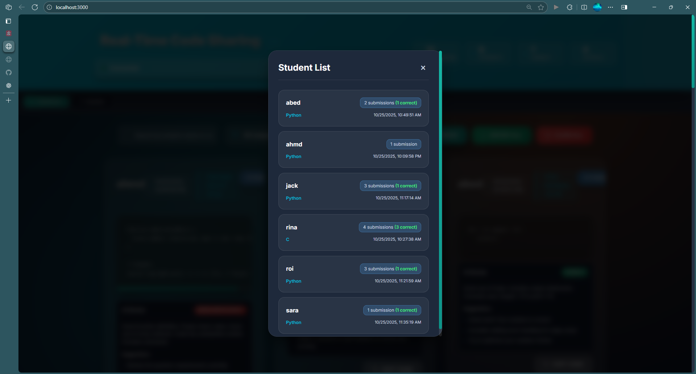
*Student management view*

**How to view:**
1. Click on the "Students" statistics card in the header
2. A modal opens showing:
   - All active students
   - Number of submissions per student
   - Activity tracking
3. Click "Close" to return to the main dashboard

### **6. Question-Specific Submissions**

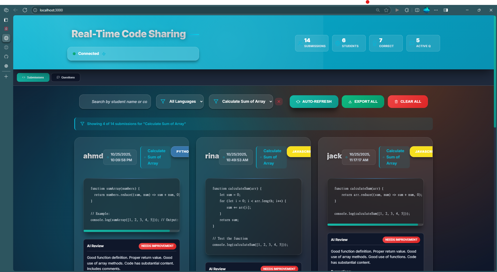
*Viewing submissions for a specific question*

**How to use:**
1. Go to the Questions tab
2. Click on a specific question
3. View all students who submitted answers
4. See individual submissions and AI reviews

### **7. VSCode Extension**

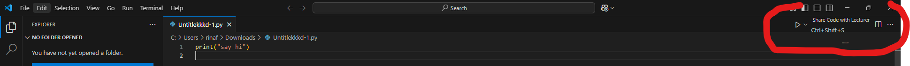
*Extension panel in VSCode*

**Features:**
- **Share Code Button**: Share selected code or entire file
- **Name Input**: Enter your name (remembered for future sessions)
- **Real-time Status**: See connection status
- **Quick Share**: One-click code sharing

---

## 📊 Key Statistics

The header shows 4 key metrics:
- **Submissions**: Total code submissions received
- **Students**: Number of active students
- **Correct**: Number of correct answers (based on AI review)
- **Active Q**: Number of currently active questions

---

## 🔧 Troubleshooting

### **Servers Won't Start**
```bash
# Kill all Node.js processes
taskkill /f /im node.exe

# Restart servers
.\start-servers.ps1
```

### **VSCode Extension Not Working**
- Make sure the extension is installed in each VSCode instance
- Check if servers are running on ports 3000 and 3001
- Restart VSCode if needed

### **Database Issues**
```bash
# Check data directory
ls backend-server/data/

# Ensure write permissions
icacls backend-server\data /grant Everyone:F
```

### **AI Review Giving Bad Grades**
The AI review system has been updated to give generous scores (80-100%) for correct code. If you're getting low scores:
1. Restart the backend server
2. Make sure the latest code is running

---

## 📋 Prerequisites

- **Node.js** (v16 or higher) - Required for running servers and building extension
- **VSCode** - Required for the extension
- **Git** - For cloning the repository
- **npm** - Usually comes with Node.js

## ⚙️ Complete Setup (First Time Only)

### **Install Dependencies for Backend:**
```bash
cd backend-server
npm install
```

### **Install Dependencies for Frontend:**
```bash
cd lecturer-interface
npm install
```

### **Build VSCode Extension:**
```bash
cd vscode-extension
npm install

# Install vsce (Visual Studio Code Extension manager) globally if not already installed
npm install -g @vscode/vsce

# Compile and package the extension
npm run compile
vsce package
```

This will create the `code-sharing-extension-1.0.0.vsix` file that you'll install in VSCode.

**Alternative (if vsce is installed):**
```bash
cd vscode-extension
vsce package --out code-sharing-extension-1.0.0.vsix
```

**Note:** You only need to run these setup commands once. After the first setup, you can just run the servers as shown in Step 1 above.

---

## 📄 License

MIT License - see LICENSE file for details.

---

**Built with ❤️ for better education and collaborative learning**

